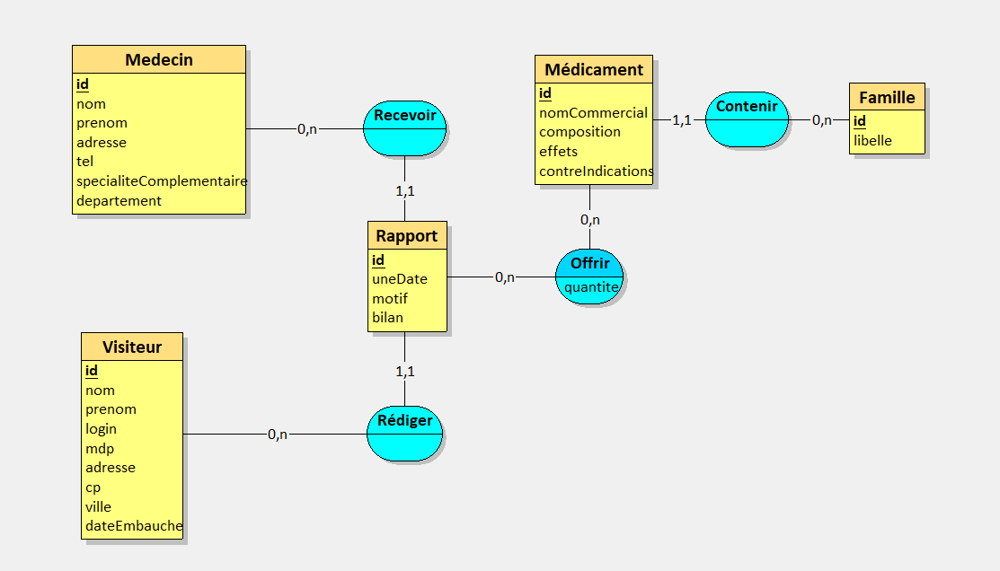
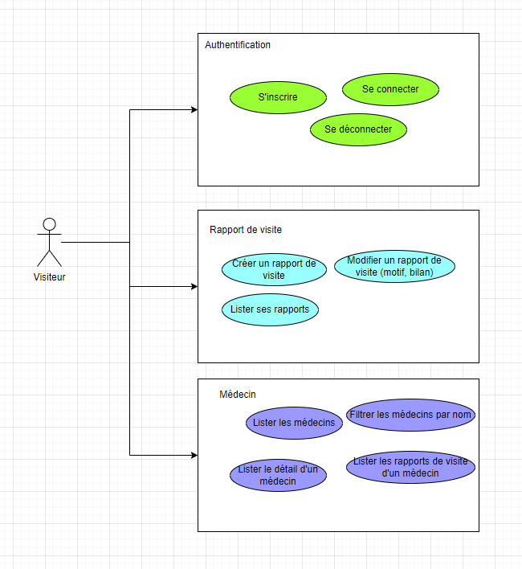

<h1 align="center">
    <br>
    
    <br>
    Galaxy Swiss Bourdin
    <br>
</h1>

<h4 align="center">
    Situation professionnelle n°1 pour l'épreuve E6 (BTS SIO)
</h4>

<p align="center">
    <em>Application de gestion des rapports de visite médicale</em>
</p>

<p align="center">
    Plateforme complète permettant aux visiteurs médicaux de gérer leurs visites chez les praticiens.
    Gestion d'authentification, des médecins, des médicaments et des rapports de visite.
</p>

<p align="center">
  <a href="#fonctionnalités">Fonctionnalités</a> •
  <a href="#installation-et-démarrage">Installation et démarrage</a> •
  <a href="#architecture">Architecture</a> •
  <a href="#stack-technique">Stack technique</a> •
  <a href="#documentation">Documentation</a> •
  <a href="#tests-de-lapplication">Tests</a> •
  <a href="#api-endpoints">API Endpoints</a>
</p>

---

## Fonctionnalités

- **Authentification sécurisée** : Connexion des visiteurs médicaux avec gestion de session
- **Gestion des médecins** : Lister, filtrer et consulter les informations des praticiens
- **Rapports de visite** : Créer, modifier et consulter les rapports de visite
- **Catalogue médicaments** : Consulter les médicaments et leurs familles
- **Suivi des échantillons** : Enregistrer les médicaments présentés et la quantité d'échantillons offerts
- **Design responsive** : Interface adaptée à tous les écrans

---

## Installation et démarrage

### Prérequis

- **Docker** et **Docker Compose** installés
    - **Windows** : Docker Desktop (obligatoire)
    - **Linux/macOS** : Docker Engine + Docker Compose

### Démarrage rapide

```bash
# Cloner le projet
git clone https://github.com/UnOrdinary95/sio-GalaxySwissBourdin.git
cd sio-GalaxySwissBourdin
cp .env.example .env
docker compose up --build -d # Lance en arrière-plan
```

### Commandes utiles

```bash
# Pour arrêter
docker compose down

# Pour arrêter et supprimer les données (volume)
docker compose down -v
```

### Accès après démarrage

- **Frontend** : http://localhost:5173
- **API** : http://localhost:3100
- **Documentation API** : http://localhost:3100/docs

---

## Architecture

Le projet utilise une architecture **monorepo** avec pnpm workspaces :

```
GalaxySwissBourdin/
├── apps/
│   ├── frontend/          # Application Vue.js (port 5173)
│   └── backend/           # API Express.js (port 3100)
├── packages/
│   ├── types/             # Types et contrats partagés
│   └── utils/             # Utilitaires partagés
├── docker/                # Configurations Docker
│   └── init-db/           # Scripts d'initialisation PostgreSQL
├── docker-compose.yaml    # Orchestration des services
└── pnpm-workspace.yaml    # Configuration pnpm workspace
```

**Services Docker :**

- **frontend** : Nginx servant l'application Vue.js
- **backend** : API Node.js/Express
- **db** : PostgreSQL avec initialisation automatique

**Flux de données :**

1. L'utilisateur interagit avec le frontend Vue.js
2. Les requêtes API sont envoyées au backend Express
3. Le backend communique avec PostgreSQL pour persister les données
4. Les réponses sont renvoyées au frontend

---

## Stack technique

### Frontend

- **Framework** : Vue.js 3
- **Langage** : TypeScript 5.x (mode strict)
- **Styling** : Tailwind CSS
- **Build tool** : Vite
- **Gestion d'état** : Composables Vue

### Backend

- **Runtime** : Node.js 20 (ES Modules)
- **Framework** : Express.js 5.x
- **Langage** : TypeScript 5.x
- **Base de données** : PostgreSQL 15
- **Authentification** : Tickets de session
- **Validation** : Zod
- **Documentation** : Swagger UI Express

### DevOps

- **Conteneurisation** : Docker + Docker Compose
- **Gestionnaire de paquets** : pnpm workspaces
- **Serveur web** : Nginx
- **Formatage** : Prettier
- **Linting** : ESLint

---

## API Endpoints

### Authentification

| Méthode | Endpoint  | Description          |
| ------- | --------- | -------------------- |
| POST    | `/login`  | Connexion visiteur   |
| POST    | `/logout` | Déconnexion visiteur |

### Visiteurs

| Méthode | Endpoint | Description                          | Auth |
| ------- | -------- | ------------------------------------ | ---- |
| GET     | `/users` | Liste de tous les visiteurs médicaux | ✓    |

### Médecins

| Méthode | Endpoint           | Description                   | Auth |
| ------- | ------------------ | ----------------------------- | ---- |
| GET     | `/medecins`        | Liste de tous les médecins    | ✓    |
| GET     | `/medecins/search` | Rechercher un médecin par nom | ✓    |
| GET     | `/medecins/:id`    | Détails d'un médecin          | ✓    |

### Rapports

| Méthode | Endpoint                | Description                        | Auth |
| ------- | ----------------------- | ---------------------------------- | ---- |
| GET     | `/rapports`             | Liste des rapports du visiteur     | ✓    |
| GET     | `/rapports/:id`         | Détails d'un rapport               | ✓    |
| POST    | `/rapports`             | Créer un rapport de visite         | ✓    |
| PUT     | `/rapports/:id`         | Modifier un rapport (motif, bilan) | ✓    |
| GET     | `/rapports/medecin/:id` | Liste des rapports d'un médecin    | ✓    |

### Médicaments

| Méthode | Endpoint       | Description                       | Auth |
| ------- | -------------- | --------------------------------- | ---- |
| GET     | `/medicaments` | Liste de tous les médicaments     | ✓    |
| GET     | `/familles`    | Liste des familles de médicaments | ✓    |

**Légende :** ✓ = Authentification requise

---

## Documentation

### Modèle Conceptuel de Données (MCD)

<p align="center">
  
</p>

Le schéma de la base de données comprend 6 tables principales :

- **Visiteur** : Stocke les informations des visiteurs médicaux (nom, prénom, login, mot de passe)
- **Medecin** : Contient les données des praticiens (nom, prénom, adresse, téléphone, spécialité)
- **Rapport** : Historise les visites effectuées (date, motif, bilan, lien vers visiteur et médecin)
- **Medicament** : Référence les produits pharmaceutiques avec leurs caractéristiques
- **Famille** : Classification des médicaments par famille thérapeutique
- **Offrir** : Table de liaison entre rapport et médicaments (quantité d'échantillons offerts)

### Diagramme de cas d'utilisation

<p align="center">
  
</p>

Le système est destiné aux **Visiteurs médicaux** avec les fonctionnalités suivantes :

**Authentification** :

- S'inscrire / Se connecter / Se déconnecter

**Rapport de visite** :

- Créer un rapport de visite
- Modifier un rapport de visite (motif, bilan)
- Lister ses rapports

**Médecin** :

- Lister les médecins
- Filtrer les médecins par nom
- Lister le détail d'un médecin
- Lister les rapports de visite d'un médecin

---

## Tests de l'application

Pour tester l'application, utilisez les comptes suivants pré-configurés dans la base de données :

### Jeu d'essai

La base de données contient :

- 20 familles de médicaments
- 1000 médecins
- 28 médicaments
- 1589 rapports de visite
- 27 visiteurs

### Compte de test

| Login    | Mot de passe |
| -------- | ------------ |
| `aribiA` | `aaaa`       |

### Fonctionnalités à tester

1. **Parcours visiteur** : Se connecter, naviguer sur la liste des médecins, filtrer par nom
2. **Détail médecin** : Consulter les informations d'un médecin et ses rapports
3. **Création rapport** : Créer un nouveau rapport de visite avec médicaments
4. **Modification rapport** : Modifier le motif ou le bilan d'un rapport existant

---

## Configuration environnement

Copier le fichier `.env.example` vers `.env` :

```bash
cp .env.example .env
```

Les variables sont pré-configurées pour fonctionner avec Docker. Modifiez-les si nécessaire.

---

<p align="center">
    <strong>Galaxy Swiss Bourdin</strong> — Projet BTS SIO SLAM
</p>
